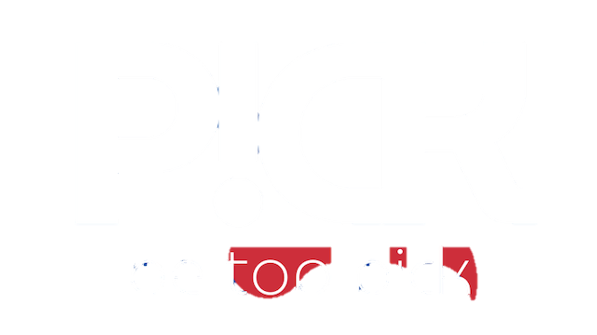

<!DOCTYPE html>
<html lang="ru">
<head>
    <meta charset="UTF-8">
    <meta name="viewport" content="width=device-width, initial-scale=1.0">
    <title>PICK: Грант в Корею. Программа подготовки к поступлению</title>
    
    <link href="https://fonts.googleapis.com/css2?family=Inter:wght@100..900&display=swap" rel="stylesheet">
    
    

    
</head>
<body>

    <header class="p-4 bg-gray-900 shadow-xl sticky top-0 z-20">
        

            
            
            <nav class="space-x-6 hidden sm:block font-medium">
                <a href="#process" class="text-white hover:text-blue-400 transition">Процесс</a>
                <a href="#ai-coordinator" class="text-white hover:text-blue-400 transition">AI-Координатор 🎯</a>
                <a href="#prize" class="text-white hover:text-blue-400 transition">Авиабилеты ✈️</a>
            </nav>
            <a href="https://docs.google.com/forms/d/e/1FAIpQLSfVxNrfayVQuPa5MRNCPeyZI9GVcbfDg0KitNgAwAT3CkEiCw/viewform?usp=dialog" target="_blank" 
               class="px-5 py-2 cta-button text-sm rounded-lg shadow-md hidden sm:block flex items-center justify-center">
                Записаться
            </a>
            <button class="sm:hidden text-2xl text-white">☰</button>
        

    </header>

    <section class="hero-bg text-white pb-16 md:pb-24">
        

            
PICK EDUCATION

            <h1 class="text-4xl sm:text-6xl font-extrabold mb-6 tracking-tight">
                <strong>Стипендия</strong> в Корею: Легче, чем кажется.
            </h1>
            

                Твой путь к <strong>100% гранту</strong>. Не просто консультации, а полноценная 2-х годовая программа с индивидуальным подходом.
            

            

                <a href="https://docs.google.com/forms/d/e/1FAIpQLSfVxNrfayVQuPa5MRNCPeyZI9GVcbfDg0KitNgAwAT3CkEiCw/viewform?usp=dialog" target="_blank" 
                   class="cta-button inline-block px-10 py-3 text-lg font-bold rounded-lg shadow-lg uppercase tracking-wider flex items-center justify-center">
                    Сделать первый шаг
                </a>
                
                <a href="#process" class="secondary-cta inline-block px-10 py-3 text-lg font-bold rounded-lg shadow-lg uppercase tracking-wider text-black">
                    Узнать подробнее
                </a>
            

            

                Уже <strong>50+ студентов</strong> достигли своих целей вместе с PICK.
            

        

    </section>

    <section id="process" class="py-16 md:py-24 bg-black">
        

            <h2 class="text-3xl md:text-4xl font-bold mb-12 section-heading mx-auto">
                Основа Программы PICK
            </h2>
            

                PICK — это тщательно разработанный 2-х годовой план, который начинается с языковой подготовки и заканчивается стратегической подачей документов.
            

            

                
                

                    
1

                    <h3 class="text-xl font-bold mb-3 text-white">Обучение Корейскому и TOPIK</h3>
                    

                        Начинаем с нуля и доводим до уровня TOPIK 4-6. Наша цель — не только сертификат, но и свободное владение языком для успешной академической жизни.
                    

                

                

                    
2

                    <h3 class="text-xl font-bold mb-3 text-white">Развитие Внешкольного Профайла</h3>
                    

                        Второй шаг: индивидуальная работа над профайлом, чтобы создать яркое досье. Мы помогаем с волонтёрством, сбором сертификатов и участием в олимпиадах.
                    

                

                

                    
3

                    <h3 class="text-xl font-bold mb-3 text-white">Идеальное Эссе и Интервью</h3>
                    

                        Разработка убедительного мотивационного письма и учебного плана. Третий шаг: подготовка к интервью, чтобы студент уверенно доказал свою ценность приемной комиссии.
                    

                

                

                    
4

                    <h3 class="text-xl font-bold mb-3 text-white">Стратегический Выбор ВУЗов и Обучение Подаче</h3>
                    

                        Четвертый шаг: мы составляем лучший список университетов для вашего профиля и **обучаем** вас правильной процедуре подачи заявлений, чтобы вы могли самостоятельно выбрать самый выгодный грант.
                    

                

            

        

    </section>

    <section id="ai-coordinator" class="py-16 md:py-24 bg-[#1f2937]">
        

            <h2 class="text-3xl md:text-4xl font-bold mb-12 text-center section-heading mx-auto">
                AI-Координатор: Реалистичный Анализ Гранта 🎯
            </h2>
            

                

                    Введите ваши текущие данные, чтобы получить реалистичный анализ шансов на стипендию.
                

                

                    <input type="text" id="targetMajor" placeholder="Желаемая Специальность (напр., Computer Science)" class="input-style" required>
                    <input type="text" id="currentTOPIK" placeholder="Текущий уровень TOPIK (напр., 5 или 6)" class="input-style" required>
                

                <textarea type="text" id="currentGPA" placeholder="Средний балл (GPA) из аттестата/транскрипта (напр., 4.7/5.0)" rows="1" class="input-style resize-none" required></textarea>
                <textarea id="currentAchievements" placeholder="Ключевые достижения, внеклассная деятельность, награды (ВАЖНО!)" rows="3" class="input-style resize-none" required></textarea>

                <button id="evaluateButton" class="cta-button w-full px-8 py-3 rounded-lg uppercase tracking-wider disabled:opacity-50 flex items-center justify-center">
                    Получить Реалистичный Анализ
                    

                </button>
                
                

                    <h4 class="text-2xl font-bold text-blue-400 mb-4">Анализ AI-Координатора:</h4>
                    

                    

                        <strong>Этот анализ</strong> основан на исторических данных. Для получения **гарантированного сопровождения** и индивидуальной стратегии, запишитесь на консультацию.
                    

                

            

        

    </section>

    <section id="prize" class="py-16 md:py-24 bg-[#101010]">
        

            <h2 class="text-3xl md:text-4xl font-bold mb-12 text-center section-heading mx-auto">
                Бесплатные Авиабилеты: Шанс для Топ-Студентов ✈️
            </h2>
            
            

                
                

                    <h3 class="text-3xl font-extrabold text-blue-400 mb-4 flex items-center">
                        <svg class="w-8 h-8 mr-3" fill="currentColor" viewBox="0 0 24 24"><path d="M12 2C6.477 2 2 6.477 2 12s4.477 10 10 10 10-4.477 10-10S17.523 2 12 2zm-1 15.938v-3.876h2v3.876H11zm0-4.876V6.062h2v7.001H11z"/></svg>
                        Перелет в Корею: Бонус за 100% Грант!
                    </h3>
                    

                        Получите <strong class="text-white">ОПЛАЧЕННЫЙ АВИАБИЛЕТ</strong> от PICK! Студенты, <strong class="underline">зарегистрировавшиеся до 31 ОКТЯБРЯ</strong> и вошедшие в тройку лучших (<strong class="text-blue-300">Топ-3</strong>) по результатам поступления на 100% грант, получат наш специальный спонсорский бонус.
                    

                    

                        Мы ценим стремление к совершенству. PICK спонсирует авиабилеты для трех самых успешных студентов каждого семестра, которые добились максимального 100% гранта в топовых университетах Кореи.
                    

                    <ul class="space-y-3 text-gray-300">
                        <li class="flex items-center">
                            ✈️
                            <strong>Топ-3 студента</strong>, успешно поступивших с 100% грантом.
                        </li>
                        <li class="flex items-center">
                            🚀
                            Билеты на перелет в Корею **БЕСПЛАТНО** за счет PICK.
                        </li>
                    </ul>
                

            

        

    </section>

    <section class="py-16 md:py-24 bg-black">
        

            <h2 class="text-3xl md:text-4xl font-bold mb-12 section-heading mx-auto">
                Истории Успеха
            </h2>

            

                

                    
"Когда я только узнала о программе PICK, даже не могла представить, насколько сильно она изменит мою жизнь. За два года я не только улучшила свой корейский и прошла серьезную подготовку, но и поняла, в каком направлении хочу развиваться. Благодаря поддержке кураторов и преподавателей, я смогла поступить в K-ARTS – вуз моей мечты – и получить полную стипендию на одном из самых конкурентных направлений. Я безмерно благодарна всей команде PICK и Диане за веру в меня и за ту невероятную возможность, которую они мне дали."

                    
— Карина, 17 лет, г. Алматы. Поступила в K-ARTS (Сеул), специальность – арт-менеджмент. Самая престижная стипендия.

                

                

                    
"Программа PICK стала для меня настоящим трамплином. Я всегда интересовался IT, но не знал, с чего начать, и не верил, что реально поступить за границу на полную стипендию. Благодаря PICK я систематизировал знания, подтянул язык и научился правильно подавать себя на международном уровне. Поступление в Inha University на 100% стипендию – это результат не только моего труда, но и той огромной поддержки, которую я получил в PICK."

                    
— Азамат, 18 лет, г. Астана. Поступил в Inha University (Южная Корея), специальность – информационные технологии. 100% стипендия на 4 года.

                

                

                    
"С самого детства я мечтала стать врачом, но обучение за границей казалось чем-то недостижимым, тем более в Корее. PICK изменил это. Здесь я получила не только академическую подготовку, но и уверенность в себе. Каждое занятие, консультации, подготовка к собеседованиям – всё это сыграло ключевую роль. Сейчас я начинаю обучение в медицинском университете в Южной Корее, и моя мечта становится реальностью. Я искренне благодарна команде PICK за их профессионализм и человечность."

                    
— Милана, 17 лет, г. Актобе. Поступила в Ulsan University, специальность – медицина. 100% стипендия.

                

            

        

    </section>
    
    <section id="free-trial" class="py-16 md:py-24 bg-blue-900 text-white text-center">
        

            <h2 class="text-3xl sm:text-4xl font-bold mb-4">
                Начните <strong>бесплатную консультацию</strong>.
            </h2>
            

                Запишитесь, чтобы составить индивидуальный план поступления и узнать свой реальный шанс на грант.
            

            

                 <a href="https://docs.google.com/forms/d/e/1FAIpQLSfVxNrfayVQuPa5MRNCPeyZI9GVcbfDg0KitNgAwAT3CkEiCw/viewform?usp=dialog" target="_blank"
                    class="cta-button w-full sm:w-auto px-8 py-3 rounded-lg uppercase tracking-wider flex items-center justify-center">
                    Записаться сейчас
                </a>
            

        

    </section>

    <footer id="contacts" class="bg-gray-900 text-gray-400 py-10">
        

            
            

                <a href="#" class="text-3xl font-extrabold text-white mb-2 block">PICK</a>
                
EdTech Platform &copy; 2025. Все права защищены.

            

            

                <a href="https://www.instagram.com/pick_topik/?igsh=YWU4NnEwMG1jdGk1#" target="_blank" class="hover:text-blue-400 transition" aria-label="Instagram">
                    <svg xmlns="http://www.w3.org/2000/svg" width="24" height="24" viewBox="0 0 24 24" fill="none" stroke="currentColor" stroke-width="2" stroke-linecap="round" stroke-linejoin="round" class="lucide lucide-instagram">
                        <rect width="20" height="20" x="2" y="2" rx="5" ry="5"></rect>
                        <path d="M16 11.37A4 4 0 1 1 12.63 8 4 4 0 0 1 16 11.37z"></path>
                        <line x1="17.5" x2="17.5" y1="6.5" y2="6.5"></line>
                    </svg>
                </a>
                
                <a href="https://wa.me/77764392660" target="_blank" class="hover:text-green-400 transition" aria-label="WhatsApp">
                    <svg xmlns="http://www.w3.org/2000/svg" width="24" height="24" viewBox="0 0 24 24" fill="none" stroke="currentColor" stroke-width="2" stroke-linecap="round" stroke-linejoin="round" class="lucide lucide-message-circle">
                        <path d="M7.9 20A9.3 9.3 0 0 1 4 16.1L2 22l6-2"></path>
                        <path d="M19 19a2 2 0 0 0 2-2V7a2 2 0 0 0-2-2H5a2 2 0 0 0-2 2v10a2 2 0 0 0 2 2h14z"></path>
                    </svg>
                </a>
            

    </footer>

    

</body>
</html>
